# racerand benchmarks

Run started 2026-09-08 14:43:23 UTC; generated by `racerand-bench`.

| | |
|---|---|
| CPU | Apple M5 Pro |
| Cores | 15 (GOMAXPROCS 15) |
| OS / arch | darwin / arm64 |
| Go | go1.26.5 |
| Quality sample | 1048576 bytes per generator |
| Throughput window | 1s per measurement |
| Sweep samples | 65536 raw samples per point |

These are single-run measurements, not entropy or security guarantees. The jitter rows use this repository's small timing baseline, not jitterentropy or HAVEGE. H values are assumptions. Errors record rejected configurations or interrupted measurements.

Contents: [example output](#what-the-output-looks-like) · [throughput](#throughput) · [Uint64](#uint64-cost) · [quality](#statistical-quality) · [NIST](#nist-sp-800-22-subset) · [worker sweep](#raw-source-worker-sweep) · [variants](#raw-source-variants) · [GOMAXPROCS](#gomaxprocs-sweep) · [latency](#latency) · [go test -bench](#go-test--bench) · [method](#method)

## What the output looks like

Image samples: 1048576 bytes per generator, collected 2026-09-08T18:44:41+04:00.

Example output from each generator, unprocessed. **Bytes**: 64 KiB as 256×256 grayscale pixels, one byte per pixel. **Bits**: 8 KiB as 256×256 black-and-white pixels, one bit per pixel. **Lag plot**: a 256×256 density map of consecutive byte pairs (x = byte *i*, y = byte *i+1*, origin bottom-left) over the whole sample, log-scaled; independent uniform bytes give even noise, serial structure gives lines and hot spots. Each lag image has its own brightness scale. Images use separate samples from the statistical tests; visible uniformity does not prove unpredictability.

| Generator | Bytes | Bits | Lag plot | First 32 bytes |
|---|---|---|---|---|
| racerand raw (atomic) | 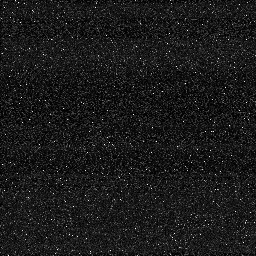 | 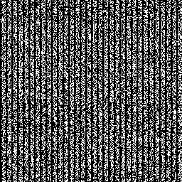 | 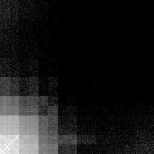 | `40060015160f06131d221525140b00f1`<br>`101313100c2d2712381d181800151818` |
| racerand raw (unsynchronized) | 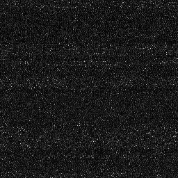 | 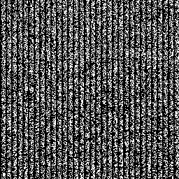 | 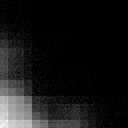 | `240c03221002033d0c1a3b06092c101f`<br>`101e3711146418030304053017033d03` |
| racerand TRNG (H=0.5 default) |  |  |  | `33b14ad7172fc4abf497cafa429423de`<br>`7c8543105dd6870544dbd61d820fc8fb` |
| racerand TRNG (H=2 assumed) | 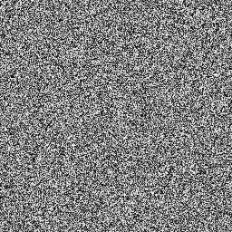 |  |  | `e5e3060baf4b035482c92bb4d124ab7b`<br>`8f62319306c6ff0da8ca565df5c9b122` |
| racerand DRBG ChaCha8 | 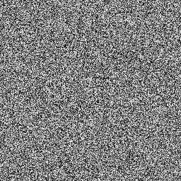 |  |  | `0c5179f3169a868e1748ab73a226f02b`<br>`621983fc3473e68cfeb1cc9d5d411df2` |
| racerand DRBG AES-256-CTR | 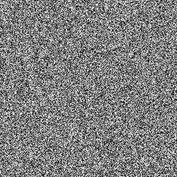 |  |  | `7fc9528c7e1843c5346ad1bc33846d00`<br>`a8d8d72c72b8b2521d7c69889913fe98` |
| racerand DRBG ChaCha8 + OS mix | 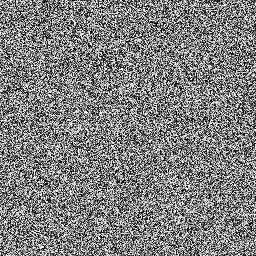 |  |  | `a3287e2f3c0e5af8ed5ffeeca678ae04`<br>`c6ab577ee50f67c076c0ddac6e9db04f` |
| crypto/rand |  |  |  | `1f45b255aad6a7b4e4ccdbfe198e466d`<br>`339b5b9a0feeaec19acd7cbb571859dd` |
| math/rand/v2 ChaCha8 | 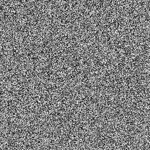 |  |  | `8886e67ac1077785e3d4b89b5213b639`<br>`a3ee7a750f2af0f9170477812f25cd35` |
| math/rand/v2 PCG |  |  |  | `2b2423ec0834ef0cbb43757c902f471b`<br>`f69bf7399c1003fee86666845555db17` |
| math/rand (v1) | 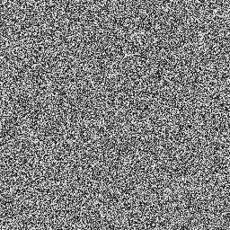 |  |  | `635786839ed1bcd51f25ee2f5a214c6c`<br>`f6aa2768e51944c572b9c1932ec47f82` |
| jitter raw | 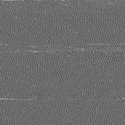 | 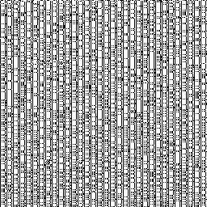 | 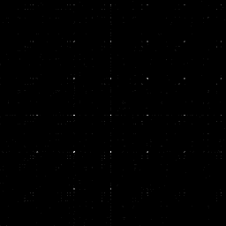 | `8d859e3fbd3fc6c7cb73cb76fad14fd0`<br>`d0fad076a6a7d1d0d0d0a7a7d1a6a7a6` |
| jitter conditioned (SHA-512, 2048/block) | 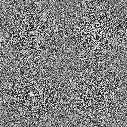 |  |  | `b1bc00bd46d8acb26ab968af8f0b3bba`<br>`19bb08925000a82df9dea45f7c19f8d2` |

## Throughput

Bytes delivered per second through `io.Reader`. The racerand raw and TRNG rows run with persistent workers, so they also occupy `workers` cores while reading; DRBG workers run during startup and reseeding. Throughput is delivered output, not an entropy rate.

| Generator | Family | 64 B reads | 64 KiB reads |
|---|---|---:|---:|
| racerand raw (atomic) | racerand | 3.1 MB/s | 3.1 MB/s |
| racerand raw (unsynchronized) | racerand | 3.3 MB/s | 3.2 MB/s |
| racerand TRNG (H=0.5 default) | racerand | 96.3 KB/s | 92.5 KB/s |
| racerand TRNG (H=2 assumed) | racerand | 384.3 KB/s | 387.6 KB/s |
| racerand DRBG ChaCha8 | racerand | 817.7 MB/s | 966.1 MB/s |
| racerand DRBG AES-256-CTR | racerand | 944.2 MB/s | 1.05 GB/s |
| racerand DRBG ChaCha8 + OS mix | racerand | 679.4 MB/s | 716.7 MB/s |
| crypto/rand | stdlib | 360.6 MB/s | 5.17 GB/s |
| math/rand/v2 ChaCha8 | stdlib | 2.07 GB/s | 2.36 GB/s |
| math/rand/v2 PCG | stdlib | 2.25 GB/s | 2.35 GB/s |
| math/rand (v1) | stdlib | 1.43 GB/s | 1.60 GB/s |
| jitter raw | jitter | 7.2 MB/s | 7.2 MB/s |
| jitter conditioned (SHA-512, 2048/block) | jitter | 213.2 KB/s | 215.4 KB/s |

## Uint64 cost

Nanoseconds per `Uint64()` call. racerand takes a mutex on every call because a Reader is safe for concurrent use; the local math/rand generators do not. crypto/rand supports concurrent reads. The duration harness includes function-call overhead.

| Generator | ns/op |
|---|---:|
| racerand DRBG ChaCha8 | 16.66 |
| racerand DRBG AES-256-CTR | 25.88 |
| crypto/rand | 52.12 |
| math/rand/v2 ChaCha8 | 3.64 |
| math/rand/v2 PCG | 3.22 |
| math/rand (v1) | 2.31 |

## Statistical quality

Distribution diagnostics inspired by ent and SP 800-90B on 1048576 bytes from each generator. Ideal values: Shannon 8, MCV byte 8, conditional 8, Markov 1, chi-square p away from 0 and 1, mean 127.5, pi error 0, serial correlation 0, compression ratio about 1. Finite samples lower the frequency estimates even for good generators. Conditional and Markov columns are simplified diagnostics, not validated entropy bounds.

| Generator | Shannon (bits/B) | MCV min-entropy (bits/B) | Cond. min-entropy (bits/B) | Markov (bits/bit) | χ² p | Mean | π error % | Serial corr. | Compression |
|---|---:|---:|---:|---:|---:|---:|---:|---:|---:|
| racerand raw (atomic) | 6.084 | 5.15 | 4.51 | 0.532 | 0.000 | 25.58 | 27.28 | 0.0416 | 0.759 |
| racerand raw (unsynchronized) | 6.063 | 4.77 | 4.52 | 0.516 | 0.000 | 25.19 | 27.32 | -0.0664 | 0.760 |
| racerand TRNG (H=0.5 default) | 8.000 | 7.89 | 7.18 | 1.000 | 0.756 | 127.45 | 0.13 | 0.0000 | 1.000 |
| racerand TRNG (H=2 assumed) | 8.000 | 7.89 | 7.18 | 0.999 | 0.391 | 127.49 | 0.02 | 0.0006 | 1.000 |
| racerand DRBG ChaCha8 | 8.000 | 7.88 | 7.17 | 0.999 | 0.172 | 127.51 | 0.00 | 0.0004 | 1.000 |
| racerand DRBG AES-256-CTR | 8.000 | 7.89 | 7.17 | 0.999 | 0.947 | 127.52 | 0.04 | 0.0009 | 1.000 |
| racerand DRBG ChaCha8 + OS mix | 8.000 | 7.88 | 7.17 | 0.999 | 0.068 | 127.46 | 0.01 | 0.0002 | 1.000 |
| crypto/rand | 8.000 | 7.89 | 7.17 | 1.000 | 0.847 | 127.45 | 0.10 | -0.0015 | 1.000 |
| math/rand/v2 ChaCha8 | 8.000 | 7.88 | 7.17 | 0.999 | 0.458 | 127.46 | 0.08 | 0.0006 | 1.000 |
| math/rand/v2 PCG | 8.000 | 7.89 | 7.18 | 0.999 | 0.028 | 127.44 | 0.07 | -0.0006 | 1.000 |
| math/rand (v1) | 8.000 | 7.88 | 7.16 | 1.000 | 0.994 | 127.44 | 0.05 | 0.0000 | 1.000 |
| jitter raw | 1.471 | 0.78 | 0.79 | 0.684 | 0.000 | 108.39 | 27.15 | 0.1466 | 0.115 |
| jitter conditioned (SHA-512, 2048/block) | 8.000 | 7.88 | 7.18 | 0.999 | 0.691 | 127.44 | 0.03 | 0.0018 | 1.000 |

## NIST SP 800-22 subset

p-values at α = 0.01 on the same data. ✓ is p ≥ 0.01. Eleven p-values are reported, including multiple results from some test families. Occasional failures are expected at this significance level. Neither passing nor failing establishes cryptographic security; n/a means the test was not applicable.

| Generator | Passed | Frequency (Monobit) | Block Frequency (M=128) | Runs | Longest Run of Ones | Binary Matrix Rank | Cumulative Sums (fwd) | Cumulative Sums (bwd) | Approximate Entropy (m=2) | Serial (m=3) P1 | Serial (m=3) P2 | Maurer's Universal |
|---|---:|---:|---:|---:|---:|---:|---:|---:|---:|---:|---:|---:|
| racerand raw (atomic) | 0/11 | ✗ 0.0e+00 | ✗ 0.0e+00 | ✗ 0.0e+00 | ✗ 0.0e+00 | ✗ 0.0e+00 | ✗ 0.0e+00 | ✗ 0.0e+00 | ✗ 0.0e+00 | ✗ 0.0e+00 | ✗ 0.0e+00 | ✗ 0.0e+00 |
| racerand raw (unsynchronized) | 0/11 | ✗ 0.0e+00 | ✗ 0.0e+00 | ✗ 0.0e+00 | ✗ 0.0e+00 | ✗ 0.0e+00 | ✗ 0.0e+00 | ✗ 0.0e+00 | ✗ 0.0e+00 | ✗ 0.0e+00 | ✗ 0.0e+00 | ✗ 0.0e+00 |
| racerand TRNG (H=0.5 default) | 11/11 | ✓ 0.351 | ✓ 0.155 | ✓ 0.507 | ✓ 0.920 | ✓ 0.206 | ✓ 0.672 | ✓ 0.470 | ✓ 0.515 | ✓ 0.515 | ✓ 0.377 | ✓ 0.399 |
| racerand TRNG (H=2 assumed) | 11/11 | ✓ 0.569 | ✓ 0.973 | ✓ 0.020 | ✓ 0.180 | ✓ 0.279 | ✓ 0.422 | ✓ 0.899 | ✓ 0.195 | ✓ 0.195 | ✓ 0.861 | ✓ 0.837 |
| racerand DRBG ChaCha8 | 11/11 | ✓ 0.116 | ✓ 0.438 | ✓ 0.125 | ✓ 0.660 | ✓ 0.010 | ✓ 0.180 | ✓ 0.220 | ✓ 0.269 | ✓ 0.269 | ✓ 0.834 | ✓ 0.447 |
| racerand DRBG AES-256-CTR | 11/11 | ✓ 0.658 | ✓ 0.551 | ✓ 0.460 | ✓ 0.324 | ✓ 0.793 | ✓ 0.591 | ✓ 0.721 | ✓ 0.751 | ✓ 0.751 | ✓ 0.557 | ✓ 0.068 |
| racerand DRBG ChaCha8 + OS mix | 11/11 | ✓ 0.773 | ✓ 0.549 | ✓ 0.128 | ✓ 0.197 | ✓ 0.220 | ✓ 0.486 | ✓ 0.742 | ✓ 0.554 | ✓ 0.554 | ✓ 0.732 | ✓ 0.658 |
| crypto/rand | 11/11 | ✓ 0.690 | ✓ 0.158 | ✓ 0.871 | ✓ 0.145 | ✓ 0.877 | ✓ 0.734 | ✓ 0.951 | ✓ 0.184 | ✓ 0.184 | ✓ 0.049 | ✓ 0.470 |
| math/rand/v2 ChaCha8 | 11/11 | ✓ 0.399 | ✓ 0.065 | ✓ 0.270 | ✓ 0.716 | ✓ 0.820 | ✓ 0.349 | ✓ 0.766 | ✓ 0.509 | ✓ 0.509 | ✓ 0.504 | ✓ 0.798 |
| math/rand/v2 PCG | 11/11 | ✓ 0.582 | ✓ 0.732 | ✓ 0.088 | ✓ 0.256 | ✓ 0.091 | ✓ 0.743 | ✓ 0.507 | ✓ 0.245 | ✓ 0.245 | ✓ 0.327 | ✓ 0.546 |
| math/rand (v1) | 11/11 | ✓ 0.860 | ✓ 0.312 | ✓ 0.654 | ✓ 0.720 | ✓ 0.929 | ✓ 0.924 | ✓ 0.780 | ✓ 0.929 | ✓ 0.929 | ✓ 0.727 | ✓ 0.100 |
| jitter raw | 0/11 | ✗ 0.0e+00 | ✗ 0.0e+00 | ✗ 0.0e+00 | ✗ 0.0e+00 | ✗ 0.0e+00 | ✗ 0.0e+00 | ✗ 0.0e+00 | ✗ 0.0e+00 | ✗ 0.0e+00 | ✗ 0.0e+00 | ✗ 0.0e+00 |
| jitter conditioned (SHA-512, 2048/block) | 10/11 | ✓ 0.559 | ✓ 0.519 | ✓ 0.543 | ✓ 0.721 | ✓ 0.271 | ✓ 0.781 | ✓ 0.545 | ✓ 0.669 | ✓ 0.669 | ✓ 0.438 | ✗ 0.009 |

## Raw source: worker sweep

The atomic source with feedback, sampled directly through `Harvester.Sample` (no health tests, no conditioning). MCV is the most-common-value min-entropy estimate on the full 64-bit sample; the pair column is a frequency-based next-sample guessing diagnostic. Seed columns estimate harvesting time for a 256-bit seed under H=0.5 and under the observed MCV (2x oversampling included). MCV times sample rate ignores correlation and is not a validated entropy rate. Do not use these columns to choose security parameters.

| Point | Workers | ns/sample | MCV (bits/sample) | Pair diagnostic | Shannon | Folded byte MCV | Folded byte Shannon | MCV × sample rate | Seed @H=0.5 | Seed @H=MCV |
|---|---:|---:|---:|---:|---:|---:|---:|---:|---:|---:|
| atomic w=1 | 1 | 57 | 4.60 | 4.06 | 7.71 | 4.03 | 6.09 | 80.5 Mbit/s | 59 µs | 6 µs |
| atomic w=2 | 2 | 85 | 3.60 | 2.11 | 6.97 | 3.40 | 5.44 | 42.3 Mbit/s | 87 µs | 12 µs |
| atomic w=3 | 3 | 110 | 4.97 | 2.40 | 8.08 | 3.40 | 5.46 | 45.2 Mbit/s | 113 µs | 11 µs |
| atomic w=4 | 4 | 135 | 5.88 | 2.45 | 9.45 | 3.68 | 5.88 | 43.5 Mbit/s | 138 µs | 12 µs |
| atomic w=6 | 6 | 169 | 5.93 | 2.28 | 10.18 | 3.97 | 5.97 | 35.1 Mbit/s | 173 µs | 15 µs |
| atomic w=8 | 8 | 198 | 4.83 | 1.86 | 9.85 | 4.26 | 6.14 | 24.4 Mbit/s | 203 µs | 21 µs |
| atomic w=12 | 12 | 285 | 6.33 | 1.75 | 11.49 | 4.94 | 6.24 | 22.2 Mbit/s | 292 µs | 23 µs |
| atomic w=14 | 14 | 316 | 6.12 | 1.77 | 10.98 | 4.49 | 6.27 | 19.3 Mbit/s | 324 µs | 27 µs |
| atomic w=15 | 15 | 300 | 6.74 | 1.78 | 11.53 | 4.82 | 6.25 | 22.5 Mbit/s | 307 µs | 23 µs |
| atomic w=30 | 30 | 867 | 7.11 | 1.71 | 11.96 | 4.96 | 6.32 | 8.2 Mbit/s | 888 µs | 63 µs |

## Raw source: variants

Access discipline (atomic vs. plain unsynchronized loads and stores) and the chaotic feedback loop, at one worker and at the default worker count.

| Point | Workers | ns/sample | MCV (bits/sample) | Pair diagnostic | Shannon | Folded byte MCV | Folded byte Shannon | MCV × sample rate | Seed @H=0.5 | Seed @H=MCV |
|---|---:|---:|---:|---:|---:|---:|---:|---:|---:|---:|
| atomic fb=true w=1 | 1 | 51 | 4.06 | 3.93 | 7.49 | 3.84 | 6.02 | 78.8 Mbit/s | 53 µs | 7 µs |
| atomic fb=true w=14 | 14 | 309 | 7.28 | 1.76 | 12.01 | 5.06 | 6.31 | 23.6 Mbit/s | 316 µs | 22 µs |
| atomic fb=false w=1 | 1 | 49 | 1.66 | 0.37 | 2.95 | 1.65 | 2.78 | 33.5 Mbit/s | 51 µs | 15 µs |
| atomic fb=false w=14 | 14 | 509 | 7.54 | 1.36 | 12.69 | 5.19 | 6.68 | 14.8 Mbit/s | 522 µs | 35 µs |
| unsynchronized fb=true w=1 | 1 | 59 | 3.96 | 3.74 | 7.02 | 3.50 | 5.44 | 67.4 Mbit/s | 60 µs | 8 µs |
| unsynchronized fb=true w=14 | 14 | 284 | 5.83 | 1.92 | 11.35 | 4.42 | 5.97 | 20.5 Mbit/s | 291 µs | 25 µs |
| unsynchronized fb=false w=1 | 1 | 48 | 2.28 | 2.10 | 4.67 | 2.01 | 3.84 | 47.6 Mbit/s | 49 µs | 11 µs |
| unsynchronized fb=false w=14 | 14 | 358 | 7.24 | 0.54 | 14.30 | 5.81 | 7.69 | 20.2 Mbit/s | 367 µs | 25 µs |

## GOMAXPROCS sweep

The default worker count is GOMAXPROCS-1. With GOMAXPROCS=1 workers and sampler share one execution slot; explicit yields and preemption affect sampling, and `New` refuses to start.

| Point | Workers | Samples | ns/sample | MCV (bits/sample) | Pair diagnostic | Shannon | New() |
|---|---:|---:|---:|---:|---:|---:|---|
| GOMAXPROCS=1 | 1 | 64 | 24757958 | 4.16 | -0.00 | 6.00 | racerand: GOMAXPROCS must be at least 2 for goroutines to race |
| GOMAXPROCS=2 | 1 | 65536 | 53 | 3.90 | 3.81 | 7.53 | ok |
| GOMAXPROCS=3 | 2 | 65536 | 77 | 3.04 | 1.91 | 6.18 | ok |
| GOMAXPROCS=4 | 3 | 65536 | 100 | 5.08 | 2.32 | 7.57 | ok |
| GOMAXPROCS=8 | 7 | 65536 | 206 | 6.27 | 2.15 | 10.33 | ok |
| GOMAXPROCS=15 | 14 | 65536 | 322 | 6.19 | 1.77 | 11.26 | ok |

## Latency

| Operation | µs | Notes |
|---|---:|---|
| New() with defaults | 2094.850 | startup checks, seed, worker start/stop |
| Reseed() at assumed H=0.5 | 674.068 | worker start, harvest, SHA-512, worker stop |
| Reseed() at assumed H=2 | 440.610 | worker start, harvest, SHA-512, worker stop |
| Reseed() at assumed H=4 | 405.261 | worker start, harvest, SHA-512, worker stop |
| TRNG Read(32), workers per call | 725.489 | average per call; buffered TRNG block spans two calls |
| TRNG Read(32), persistent workers | 324.049 | average per call; buffered TRNG block spans two calls |
| DRBG Read(32) | 0.023 | average per call; buffered TRNG block spans two calls |

## go test -bench

```
goos: darwin
goarch: arm64
pkg: github.com/yohimik/racerand
cpu: Apple M5 Pro
BenchmarkRead
BenchmarkRead/racerand/drbg-chacha8
BenchmarkRead/racerand/drbg-chacha8/32B
BenchmarkRead/racerand/drbg-chacha8/32B-15     	 7802094	        56.73 ns/op	 564.06 MB/s	       0 B/op	       0 allocs/op
BenchmarkRead/racerand/drbg-chacha8/32B-15     	 5000589	        73.60 ns/op	 434.80 MB/s	       0 B/op	       0 allocs/op
BenchmarkRead/racerand/drbg-chacha8/32B-15     	 7607956	        46.79 ns/op	 683.91 MB/s	       0 B/op	       0 allocs/op
BenchmarkRead/racerand/drbg-chacha8/4096B
BenchmarkRead/racerand/drbg-chacha8/4096B-15   	   87620	      4301 ns/op	 952.40 MB/s	       1 B/op	       0 allocs/op
BenchmarkRead/racerand/drbg-chacha8/4096B-15   	   88244	      3958 ns/op	1034.89 MB/s	       1 B/op	       0 allocs/op
BenchmarkRead/racerand/drbg-chacha8/4096B-15   	   87061	      4083 ns/op	1003.07 MB/s	       1 B/op	       0 allocs/op
BenchmarkRead/racerand/drbg-chacha8/65536B
BenchmarkRead/racerand/drbg-chacha8/65536B-15  	    6555	     64935 ns/op	1009.25 MB/s	      27 B/op	       0 allocs/op
BenchmarkRead/racerand/drbg-chacha8/65536B-15  	    5552	     63882 ns/op	1025.89 MB/s	      23 B/op	       0 allocs/op
BenchmarkRead/racerand/drbg-chacha8/65536B-15  	    6219	     66025 ns/op	 992.60 MB/s	      23 B/op	       0 allocs/op
BenchmarkRead/racerand/drbg-aes-ctr
BenchmarkRead/racerand/drbg-aes-ctr/32B
BenchmarkRead/racerand/drbg-aes-ctr/32B-15     	 8809503	        40.06 ns/op	 798.72 MB/s	       0 B/op	       0 allocs/op
BenchmarkRead/racerand/drbg-aes-ctr/32B-15     	 9693205	        39.77 ns/op	 804.59 MB/s	       0 B/op	       0 allocs/op
BenchmarkRead/racerand/drbg-aes-ctr/32B-15     	 9015532	        41.24 ns/op	 775.99 MB/s	       0 B/op	       0 allocs/op
BenchmarkRead/racerand/drbg-aes-ctr/4096B
BenchmarkRead/racerand/drbg-aes-ctr/4096B-15   	  156512	      2644 ns/op	1549.15 MB/s	       5 B/op	       0 allocs/op
BenchmarkRead/racerand/drbg-aes-ctr/4096B-15   	  133066	      2579 ns/op	1588.10 MB/s	       5 B/op	       0 allocs/op
BenchmarkRead/racerand/drbg-aes-ctr/4096B-15   	  144842	      2598 ns/op	1576.66 MB/s	       5 B/op	       0 allocs/op
BenchmarkRead/racerand/drbg-aes-ctr/65536B
BenchmarkRead/racerand/drbg-aes-ctr/65536B-15  	    7724	     40795 ns/op	1606.48 MB/s	      88 B/op	       1 allocs/op
BenchmarkRead/racerand/drbg-aes-ctr/65536B-15  	    9182	     41132 ns/op	1593.32 MB/s	      87 B/op	       1 allocs/op
BenchmarkRead/racerand/drbg-aes-ctr/65536B-15  	    9806	     46581 ns/op	1406.91 MB/s	      88 B/op	       1 allocs/op
BenchmarkRead/racerand/drbg-chacha8-osmix
BenchmarkRead/racerand/drbg-chacha8-osmix/32B
BenchmarkRead/racerand/drbg-chacha8-osmix/32B-15         	 9504134	        40.70 ns/op	 786.30 MB/s	       0 B/op	       0 allocs/op
BenchmarkRead/racerand/drbg-chacha8-osmix/32B-15         	 9641812	        46.46 ns/op	 688.83 MB/s	       0 B/op	       0 allocs/op
BenchmarkRead/racerand/drbg-chacha8-osmix/32B-15         	 8077370	        44.73 ns/op	 715.37 MB/s	       0 B/op	       0 allocs/op
BenchmarkRead/racerand/drbg-chacha8-osmix/4096B
BenchmarkRead/racerand/drbg-chacha8-osmix/4096B-15       	   83280	      4828 ns/op	 848.46 MB/s	       1 B/op	       0 allocs/op
BenchmarkRead/racerand/drbg-chacha8-osmix/4096B-15       	   83427	      4121 ns/op	 993.89 MB/s	       1 B/op	       0 allocs/op
BenchmarkRead/racerand/drbg-chacha8-osmix/4096B-15       	   86360	      5372 ns/op	 762.42 MB/s	       1 B/op	       0 allocs/op
BenchmarkRead/racerand/drbg-chacha8-osmix/65536B
BenchmarkRead/racerand/drbg-chacha8-osmix/65536B-15      	    4128	     84766 ns/op	 773.14 MB/s	      23 B/op	       0 allocs/op
BenchmarkRead/racerand/drbg-chacha8-osmix/65536B-15      	    5052	     82249 ns/op	 796.80 MB/s	      23 B/op	       0 allocs/op
BenchmarkRead/racerand/drbg-chacha8-osmix/65536B-15      	    2468	    125621 ns/op	 521.69 MB/s	      23 B/op	       0 allocs/op
BenchmarkRead/racerand/trng
BenchmarkRead/racerand/trng/32B
BenchmarkRead/racerand/trng/32B-15                       	     991	    335468 ns/op	   0.10 MB/s	       0 B/op	       0 allocs/op
BenchmarkRead/racerand/trng/32B-15                       	    1056	    334482 ns/op	   0.10 MB/s	       0 B/op	       0 allocs/op
BenchmarkRead/racerand/trng/32B-15                       	    1076	    324671 ns/op	   0.10 MB/s	       0 B/op	       0 allocs/op
BenchmarkRead/racerand/trng/4096B
BenchmarkRead/racerand/trng/4096B-15                     	       8	  42551948 ns/op	   0.10 MB/s	       0 B/op	       0 allocs/op
BenchmarkRead/racerand/trng/4096B-15                     	       8	  42343990 ns/op	   0.10 MB/s	       0 B/op	       0 allocs/op
BenchmarkRead/racerand/trng/4096B-15                     	       8	  42337224 ns/op	   0.10 MB/s	       0 B/op	       0 allocs/op
BenchmarkRead/racerand/trng/65536B
BenchmarkRead/racerand/trng/65536B-15                    	       1	 680785625 ns/op	   0.10 MB/s	       0 B/op	       0 allocs/op
BenchmarkRead/racerand/trng/65536B-15                    	       1	 677000500 ns/op	   0.10 MB/s	       0 B/op	       0 allocs/op
BenchmarkRead/racerand/trng/65536B-15                    	       1	 675927583 ns/op	   0.10 MB/s	       0 B/op	       0 allocs/op
BenchmarkRead/racerand/raw
BenchmarkRead/racerand/raw/32B
BenchmarkRead/racerand/raw/32B-15                        	   36322	     10234 ns/op	   3.13 MB/s	       0 B/op	       0 allocs/op
BenchmarkRead/racerand/raw/32B-15                        	   35461	     10001 ns/op	   3.20 MB/s	       0 B/op	       0 allocs/op
BenchmarkRead/racerand/raw/32B-15                        	   33007	     10434 ns/op	   3.07 MB/s	       0 B/op	       0 allocs/op
BenchmarkRead/racerand/raw/4096B
BenchmarkRead/racerand/raw/4096B-15                      	     274	   1311039 ns/op	   3.12 MB/s	       0 B/op	       0 allocs/op
BenchmarkRead/racerand/raw/4096B-15                      	     266	   1348931 ns/op	   3.04 MB/s	       0 B/op	       0 allocs/op
BenchmarkRead/racerand/raw/4096B-15                      	     261	   1311134 ns/op	   3.12 MB/s	       0 B/op	       0 allocs/op
BenchmarkRead/racerand/raw/65536B
BenchmarkRead/racerand/raw/65536B-15                     	      16	  20935435 ns/op	   3.13 MB/s	       0 B/op	       0 allocs/op
BenchmarkRead/racerand/raw/65536B-15                     	      16	  22350128 ns/op	   2.93 MB/s	       0 B/op	       0 allocs/op
BenchmarkRead/racerand/raw/65536B-15                     	      15	  21469408 ns/op	   3.05 MB/s	       0 B/op	       0 allocs/op
BenchmarkRead/racerand/raw-unsync
BenchmarkRead/racerand/raw-unsync/32B
BenchmarkRead/racerand/raw-unsync/32B-15                 	   36744	      9858 ns/op	   3.25 MB/s	       0 B/op	       0 allocs/op
BenchmarkRead/racerand/raw-unsync/32B-15                 	   36764	      9727 ns/op	   3.29 MB/s	       0 B/op	       0 allocs/op
BenchmarkRead/racerand/raw-unsync/32B-15                 	   37299	      9788 ns/op	   3.27 MB/s	       0 B/op	       0 allocs/op
BenchmarkRead/racerand/raw-unsync/4096B
BenchmarkRead/racerand/raw-unsync/4096B-15               	     278	   1248110 ns/op	   3.28 MB/s	       0 B/op	       0 allocs/op
BenchmarkRead/racerand/raw-unsync/4096B-15               	     291	   1231609 ns/op	   3.33 MB/s	       0 B/op	       0 allocs/op
BenchmarkRead/racerand/raw-unsync/4096B-15               	     295	   1231172 ns/op	   3.33 MB/s	       0 B/op	       0 allocs/op
BenchmarkRead/racerand/raw-unsync/65536B
BenchmarkRead/racerand/raw-unsync/65536B-15              	      16	  19971286 ns/op	   3.28 MB/s	       0 B/op	       0 allocs/op
BenchmarkRead/racerand/raw-unsync/65536B-15              	      15	  20274083 ns/op	   3.23 MB/s	       0 B/op	       0 allocs/op
BenchmarkRead/racerand/raw-unsync/65536B-15              	      16	  21726646 ns/op	   3.02 MB/s	       0 B/op	       0 allocs/op
BenchmarkRead/crypto-rand
BenchmarkRead/crypto-rand/32B
BenchmarkRead/crypto-rand/32B-15                         	 2117438	       170.0 ns/op	 188.18 MB/s	       0 B/op	       0 allocs/op
BenchmarkRead/crypto-rand/32B-15                         	 2119029	       170.1 ns/op	 188.09 MB/s	       0 B/op	       0 allocs/op
BenchmarkRead/crypto-rand/32B-15                         	 2108410	       170.7 ns/op	 187.44 MB/s	       0 B/op	       0 allocs/op
BenchmarkRead/crypto-rand/4096B
BenchmarkRead/crypto-rand/4096B-15                       	  454208	       799.7 ns/op	5121.64 MB/s	       0 B/op	       0 allocs/op
BenchmarkRead/crypto-rand/4096B-15                       	  442502	       797.8 ns/op	5134.07 MB/s	       0 B/op	       0 allocs/op
BenchmarkRead/crypto-rand/4096B-15                       	  452377	       798.5 ns/op	5129.34 MB/s	       0 B/op	       0 allocs/op
BenchmarkRead/crypto-rand/65536B
BenchmarkRead/crypto-rand/65536B-15                      	   28794	     12530 ns/op	5230.41 MB/s	       0 B/op	       0 allocs/op
BenchmarkRead/crypto-rand/65536B-15                      	   28272	     12701 ns/op	5159.91 MB/s	       0 B/op	       0 allocs/op
BenchmarkRead/crypto-rand/65536B-15                      	   28224	     12589 ns/op	5205.65 MB/s	       0 B/op	       0 allocs/op
BenchmarkRead/math-rand-v2-chacha8
BenchmarkRead/math-rand-v2-chacha8/32B
BenchmarkRead/math-rand-v2-chacha8/32B-15                	24444273	        14.67 ns/op	2182.06 MB/s	       0 B/op	       0 allocs/op
BenchmarkRead/math-rand-v2-chacha8/32B-15                	24602696	        14.70 ns/op	2176.67 MB/s	       0 B/op	       0 allocs/op
BenchmarkRead/math-rand-v2-chacha8/32B-15                	24430519	        14.73 ns/op	2172.13 MB/s	       0 B/op	       0 allocs/op
BenchmarkRead/math-rand-v2-chacha8/4096B
BenchmarkRead/math-rand-v2-chacha8/4096B-15              	  215091	      1675 ns/op	2444.67 MB/s	       0 B/op	       0 allocs/op
BenchmarkRead/math-rand-v2-chacha8/4096B-15              	  214899	      1678 ns/op	2440.58 MB/s	       0 B/op	       0 allocs/op
BenchmarkRead/math-rand-v2-chacha8/4096B-15              	  213694	      1682 ns/op	2435.75 MB/s	       0 B/op	       0 allocs/op
BenchmarkRead/math-rand-v2-chacha8/65536B
BenchmarkRead/math-rand-v2-chacha8/65536B-15             	   13408	     26848 ns/op	2441.02 MB/s	       0 B/op	       0 allocs/op
BenchmarkRead/math-rand-v2-chacha8/65536B-15             	   13395	     26873 ns/op	2438.71 MB/s	       0 B/op	       0 allocs/op
BenchmarkRead/math-rand-v2-chacha8/65536B-15             	   13371	     27001 ns/op	2427.16 MB/s	       0 B/op	       0 allocs/op
BenchmarkRead/math-rand-v1
BenchmarkRead/math-rand-v1/32B
BenchmarkRead/math-rand-v1/32B-15                        	14814433	        23.95 ns/op	1336.08 MB/s	       0 B/op	       0 allocs/op
BenchmarkRead/math-rand-v1/32B-15                        	15225366	        23.19 ns/op	1380.10 MB/s	       0 B/op	       0 allocs/op
BenchmarkRead/math-rand-v1/32B-15                        	15856266	        22.90 ns/op	1397.65 MB/s	       0 B/op	       0 allocs/op
BenchmarkRead/math-rand-v1/4096B
BenchmarkRead/math-rand-v1/4096B-15                      	  150116	      2427 ns/op	1687.34 MB/s	       0 B/op	       0 allocs/op
BenchmarkRead/math-rand-v1/4096B-15                      	  146634	      2431 ns/op	1684.66 MB/s	       0 B/op	       0 allocs/op
BenchmarkRead/math-rand-v1/4096B-15                      	  147744	      2478 ns/op	1652.74 MB/s	       0 B/op	       0 allocs/op
BenchmarkRead/math-rand-v1/65536B
BenchmarkRead/math-rand-v1/65536B-15                     	    8742	     40612 ns/op	1613.72 MB/s	       0 B/op	       0 allocs/op
BenchmarkRead/math-rand-v1/65536B-15                     	    8840	     39303 ns/op	1667.46 MB/s	       0 B/op	       0 allocs/op
BenchmarkRead/math-rand-v1/65536B-15                     	    9190	     38913 ns/op	1684.15 MB/s	       0 B/op	       0 allocs/op
BenchmarkUint64
BenchmarkUint64/racerand/drbg-chacha8
BenchmarkUint64/racerand/drbg-chacha8-15                 	32487309	        12.05 ns/op	       0 B/op	       0 allocs/op
BenchmarkUint64/racerand/drbg-chacha8-15                 	19922954	        16.42 ns/op	       0 B/op	       0 allocs/op
BenchmarkUint64/racerand/drbg-chacha8-15                 	29757598	        12.65 ns/op	       0 B/op	       0 allocs/op
BenchmarkUint64/racerand/drbg-aes-ctr
BenchmarkUint64/racerand/drbg-aes-ctr-15                 	13741484	        22.16 ns/op	       0 B/op	       0 allocs/op
BenchmarkUint64/racerand/drbg-aes-ctr-15                 	16302993	        24.62 ns/op	       0 B/op	       0 allocs/op
BenchmarkUint64/racerand/drbg-aes-ctr-15                 	17493135	        23.10 ns/op	       0 B/op	       0 allocs/op
BenchmarkUint64/math-rand-v2-pcg
BenchmarkUint64/math-rand-v2-pcg-15                      	100000000	         3.317 ns/op	       0 B/op	       0 allocs/op
BenchmarkUint64/math-rand-v2-pcg-15                      	100000000	         3.213 ns/op	       0 B/op	       0 allocs/op
BenchmarkUint64/math-rand-v2-pcg-15                      	100000000	         3.186 ns/op	       0 B/op	       0 allocs/op
BenchmarkUint64/math-rand-v2-chacha8
BenchmarkUint64/math-rand-v2-chacha8-15                  	122693252	         2.932 ns/op	       0 B/op	       0 allocs/op
BenchmarkUint64/math-rand-v2-chacha8-15                  	122526026	         2.942 ns/op	       0 B/op	       0 allocs/op
BenchmarkUint64/math-rand-v2-chacha8-15                  	100000000	         3.088 ns/op	       0 B/op	       0 allocs/op
BenchmarkUint64/math-rand-v2-global
BenchmarkUint64/math-rand-v2-global-15                   	98486238	         3.637 ns/op	       0 B/op	       0 allocs/op
BenchmarkUint64/math-rand-v2-global-15                   	98722556	         3.631 ns/op	       0 B/op	       0 allocs/op
BenchmarkUint64/math-rand-v2-global-15                   	99502486	         3.627 ns/op	       0 B/op	       0 allocs/op
BenchmarkUint64/math-rand-v1
BenchmarkUint64/math-rand-v1-15                          	189272498	         1.901 ns/op	       0 B/op	       0 allocs/op
BenchmarkUint64/math-rand-v1-15                          	190554957	         1.892 ns/op	       0 B/op	       0 allocs/op
BenchmarkUint64/math-rand-v1-15                          	187545828	         1.944 ns/op	       0 B/op	       0 allocs/op
BenchmarkUint64/crypto-rand
BenchmarkUint64/crypto-rand-15                           	 7240370	        50.46 ns/op	       0 B/op	       0 allocs/op
BenchmarkUint64/crypto-rand-15                           	 6907866	        50.78 ns/op	       0 B/op	       0 allocs/op
BenchmarkUint64/crypto-rand-15                           	 6888216	        52.62 ns/op	       0 B/op	       0 allocs/op
BenchmarkHarvesterSample
BenchmarkHarvesterSample/atomic/workers=1
BenchmarkHarvesterSample/atomic/workers=1-15             	 6108066	        53.11 ns/op	       0 B/op	       0 allocs/op
BenchmarkHarvesterSample/atomic/workers=1-15             	 7072245	        50.76 ns/op	       0 B/op	       0 allocs/op
BenchmarkHarvesterSample/atomic/workers=1-15             	 7132966	        54.41 ns/op	       0 B/op	       0 allocs/op
BenchmarkHarvesterSample/atomic/workers=2
BenchmarkHarvesterSample/atomic/workers=2-15             	 4806932	        73.26 ns/op	       0 B/op	       0 allocs/op
BenchmarkHarvesterSample/atomic/workers=2-15             	 5061247	        71.32 ns/op	       0 B/op	       0 allocs/op
BenchmarkHarvesterSample/atomic/workers=2-15             	 4696530	        72.52 ns/op	       0 B/op	       0 allocs/op
BenchmarkHarvesterSample/atomic/workers=4
BenchmarkHarvesterSample/atomic/workers=4-15             	 3039272	       118.7 ns/op	       0 B/op	       0 allocs/op
BenchmarkHarvesterSample/atomic/workers=4-15             	 3021414	       121.0 ns/op	       0 B/op	       0 allocs/op
BenchmarkHarvesterSample/atomic/workers=4-15             	 2948667	       119.7 ns/op	       0 B/op	       0 allocs/op
BenchmarkHarvesterSample/atomic/workers=default
BenchmarkHarvesterSample/atomic/workers=default-15       	 1000000	       320.5 ns/op	       0 B/op	       0 allocs/op
BenchmarkHarvesterSample/atomic/workers=default-15       	 1000000	       315.4 ns/op	       0 B/op	       0 allocs/op
BenchmarkHarvesterSample/atomic/workers=default-15       	 1000000	       326.4 ns/op	       0 B/op	       0 allocs/op
BenchmarkHarvesterSample/unsynchronized/workers=1
BenchmarkHarvesterSample/unsynchronized/workers=1-15     	 6938120	        53.40 ns/op	       0 B/op	       0 allocs/op
BenchmarkHarvesterSample/unsynchronized/workers=1-15     	 6716119	        54.00 ns/op	       0 B/op	       0 allocs/op
BenchmarkHarvesterSample/unsynchronized/workers=1-15     	 6415634	        53.26 ns/op	       0 B/op	       0 allocs/op
BenchmarkHarvesterSample/unsynchronized/workers=2
BenchmarkHarvesterSample/unsynchronized/workers=2-15     	 4798677	        75.91 ns/op	       0 B/op	       0 allocs/op
BenchmarkHarvesterSample/unsynchronized/workers=2-15     	 4623915	        77.89 ns/op	       0 B/op	       0 allocs/op
BenchmarkHarvesterSample/unsynchronized/workers=2-15     	 4631001	        76.56 ns/op	       0 B/op	       0 allocs/op
BenchmarkHarvesterSample/unsynchronized/workers=4
BenchmarkHarvesterSample/unsynchronized/workers=4-15     	 2720769	       130.3 ns/op	       0 B/op	       0 allocs/op
BenchmarkHarvesterSample/unsynchronized/workers=4-15     	 2928195	       122.6 ns/op	       0 B/op	       0 allocs/op
BenchmarkHarvesterSample/unsynchronized/workers=4-15     	 2936404	       122.8 ns/op	       0 B/op	       0 allocs/op
BenchmarkHarvesterSample/unsynchronized/workers=default
BenchmarkHarvesterSample/unsynchronized/workers=default-15         	 1000000	       311.6 ns/op	       0 B/op	       0 allocs/op
BenchmarkHarvesterSample/unsynchronized/workers=default-15         	 1000000	       306.7 ns/op	       0 B/op	       0 allocs/op
BenchmarkHarvesterSample/unsynchronized/workers=default-15         	 1000000	       301.3 ns/op	       0 B/op	       0 allocs/op
BenchmarkReseed
BenchmarkReseed/min-entropy=0.5
BenchmarkReseed/min-entropy=0.5-15                                 	     390	    863671 ns/op	     369 B/op	      15 allocs/op
BenchmarkReseed/min-entropy=0.5-15                                 	     472	    920197 ns/op	     372 B/op	      15 allocs/op
BenchmarkReseed/min-entropy=0.5-15                                 	     319	   1179091 ns/op	     388 B/op	      15 allocs/op
BenchmarkReseed/min-entropy=2
BenchmarkReseed/min-entropy=2-15                                   	     781	    469272 ns/op	     371 B/op	      15 allocs/op
BenchmarkReseed/min-entropy=2-15                                   	     829	    516391 ns/op	     371 B/op	      15 allocs/op
BenchmarkReseed/min-entropy=2-15                                   	     615	    586506 ns/op	     370 B/op	      15 allocs/op
BenchmarkReseed/min-entropy=4
BenchmarkReseed/min-entropy=4-15                                   	     963	    349105 ns/op	     369 B/op	      15 allocs/op
BenchmarkReseed/min-entropy=4-15                                   	    1171	    392466 ns/op	     370 B/op	      15 allocs/op
BenchmarkReseed/min-entropy=4-15                                   	    1116	    377137 ns/op	     369 B/op	      15 allocs/op
BenchmarkNew
BenchmarkNew-15                                                    	     146	   2403597 ns/op	  104534 B/op	      28 allocs/op
BenchmarkNew-15                                                    	     140	   2847273 ns/op	  106657 B/op	      28 allocs/op
BenchmarkNew-15                                                    	     104	   3220083 ns/op	  105349 B/op	      28 allocs/op
BenchmarkParallelRead
BenchmarkParallelRead/os=false/32B
BenchmarkParallelRead/os=false/32B-15                              	 3108584	       117.3 ns/op	 272.74 MB/s	       0 B/op	       0 allocs/op
BenchmarkParallelRead/os=false/32B-15                              	 2862718	       126.2 ns/op	 253.53 MB/s	       0 B/op	       0 allocs/op
BenchmarkParallelRead/os=false/32B-15                              	 2885475	       127.0 ns/op	 252.02 MB/s	       0 B/op	       0 allocs/op
BenchmarkParallelRead/os=true/32B
BenchmarkParallelRead/os=true/32B-15                               	  778224	       472.0 ns/op	  67.80 MB/s	       0 B/op	       0 allocs/op
BenchmarkParallelRead/os=true/32B-15                               	  764404	       471.0 ns/op	  67.94 MB/s	       0 B/op	       0 allocs/op
BenchmarkParallelRead/os=true/32B-15                               	  781532	       468.9 ns/op	  68.25 MB/s	       0 B/op	       0 allocs/op
BenchmarkParallelRead/os=false/4096B
BenchmarkParallelRead/os=false/4096B-15                            	   64309	      7107 ns/op	 576.31 MB/s	       2 B/op	       0 allocs/op
BenchmarkParallelRead/os=false/4096B-15                            	   56522	      5545 ns/op	 738.72 MB/s	       2 B/op	       0 allocs/op
BenchmarkParallelRead/os=false/4096B-15                            	   60446	      6022 ns/op	 680.18 MB/s	       2 B/op	       0 allocs/op
BenchmarkParallelRead/os=true/4096B
BenchmarkParallelRead/os=true/4096B-15                             	  264949	      1430 ns/op	2864.26 MB/s	       0 B/op	       0 allocs/op
BenchmarkParallelRead/os=true/4096B-15                             	  264135	      1421 ns/op	2883.38 MB/s	       0 B/op	       0 allocs/op
BenchmarkParallelRead/os=true/4096B-15                             	  262477	      1434 ns/op	2857.04 MB/s	       0 B/op	       0 allocs/op
PASS
ok  	github.com/yohimik/racerand	57.672s
```

## Method

- Throughput reads through `io.ReadFull` into a fixed buffer for at least the window, in batches of at least 4 KiB between clock reads (one read for larger buffers).
- `Uint64` cost is a tight loop over a duration; the racerand rows include the mutex.
- Quality statistics come from `stattest.Analyze`; the NIST tests are the O(n) subset implemented in `stattest.NIST`, with bounded series and continued-fraction calculations for the incomplete gamma function. This is not the official NIST suite.
- Sweeps sample the raw source directly with `Harvester.Sample`, discarding up to 4096 samples as warm-up. Min-entropy figures are estimates, not proofs; the conditional estimate needs many more samples than distinct values and is pessimistic on the full 64-bit samples.
- The duration harness uses one run per point. The embedded Go benchmarks repeat three times by default. Background host activity was not controlled. Race-based entropy depends on the machine, the operating system and what else is running; rerun `make bench` on your own hardware before trusting any of it.
